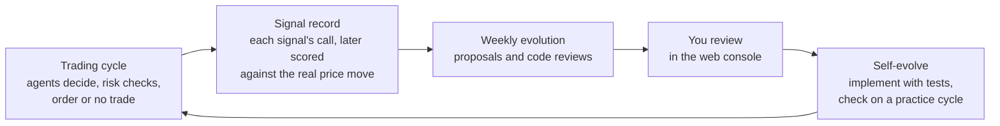

# EvoTrader

**A self-evolving AI agent that trades.**

EvoTrader is a team of AI agents that trades one US stock or ETF through your
own Robinhood account, inside hard limits the agents cannot change. Each week an
evolution agent reviews what the traders did, checks which of their signals
turned out to be right, and writes proposals to improve the strategy and the
code. You decide what gets built; changes land with tests; the loop runs again.

Created by Adam Chiu · ImmersiaLabs

> [!CAUTION]
> **Disclaimer — read this first.** EvoTrader is experimental software. It is
> **not investment advice**, and nothing it says or does is a recommendation to
> buy or sell anything. Trading is risky: **you can lose all the money you trade
> with it**, and an automated system can lose it quickly. The software is
> provided **"as is", without warranties or conditions of any kind**, and the
> authors accept no liability for any loss (see sections 7 and 8 of the
> [Apache License 2.0](LICENSE)). You run it on **your own** broker account,
> signed in with **your own** login, and you alone are responsible for every
> order it places and for following your broker's terms of service.
>
> **What this is, and is not.** EvoTrader is a research project — and, frankly,
> a hobby and something of a social experiment in letting AI agents run and
> revise their own process. Its hypothesis is that a self-evolving agent can
> calibrate a trading algorithm's parameters and propose new strategies as
> market conditions change. **That hypothesis is unproven.** The project makes
> no claim that the system is, or will be, profitable, and it publishes no
> trading results: whatever it does on your account is yours alone. It is not
> a trading service and it does not provide trading advice.

---

## The idea

- **An AI that improves its own trading.** EvoTrader's bet is that AI agents
  can find a trading algorithm that works and keep recalibrating it as the
  market changes. Every decision is scored against what the price actually did;
  every week an evolution agent studies that record and proposes better
  strategies and parameters; you approve what ships, and a coding agent builds
  it with tests. Then the loop runs again.
- **Built to run safely while it learns.** Hard limits the agents cannot
  change, a risk check in code on every order, practice mode with play money by
  default, and your approval before anything trades real money.
- **Early days (version 0.2.0, alpha).** It trades one instrument at a time,
  during US market hours, through Robinhood only. Expect rough edges.

## How it works



1. **Trading cycle.** On the schedule you set (for example hourly during market
   hours) or when you press **Trade** in the console, a team of agents makes one
   decision. Code fetches prices and computes the *algorithm's signal*: a number
   from −1 (sell) to +1 (buy) that combines several rule-based strategies (ten
   ship with the code). A news agent reads the news, a strategy agent weighs
   everything and proposes a trade or no trade, a risk-manager agent checks the
   proposal against your limits, and an executor agent places the order through
   a code *risk gate*.
2. **Signal attribution.** Every cycle — including the ones that do not trade —
   records what each "witness" said: the algorithm, the news, and the strategy
   agent's own reasoning. Once the market has moved, the system scores each one
   against what the price actually did one and five trading days later.
3. **Weekly evolution.** An evolution agent reads the recent cycles, the scored
   record and the source code, then writes *strategy proposals* (new strategies,
   weight or parameter changes) and *code reviews* (bugs it found, with
   suggested fixes) into your data folder.
4. **Human review.** You read them in the console and apply or reject them.
   Nothing the evolution agent writes changes the running system by itself:
   new algorithm and instruction versions wait for you to switch them on, and
   code changes are only ever proposals.
5. **Self-evolve implementation.** You — or Claude Code using the `self-evolve`
   skill in this repository — build the approved change: write a failing test
   first, fix the code, and check it on a practice cycle before it trades real
   money.

The details, with diagrams, are in **[docs/architecture.md](docs/architecture.md)**.
Two real outputs of the loop, anonymised, are in [docs/examples/](docs/examples/).

## Requirements

| What | Why |
|---|---|
| macOS or Linux | The scripts are bash. On Windows, use WSL (not tested). |
| [uv](https://docs.astral.sh/uv/getting-started/installation/) | Installs Python 3.12+ and every dependency for you. |
| An AI provider key | **Google Gemini** is the default: the cheapest, and what the system is developed and tested on ([get a key](https://aistudio.google.com/app/apikey)). **Anthropic Claude** is supported, including running the strategy and evolution agents on a Claude subscription through Claude Code ([how](docs/claude_code_evolution.md)). **OpenAI** models can be selected but are **experimental**: little tested. |
| A Robinhood account with **agentic trading** enabled | Robinhood's feature that lets an AI agent trade through its official MCP server. (MCP, the Model Context Protocol, is a standard way for AI agents to call outside tools.) **Needed even for practice mode**, because prices, price history and option data come from Robinhood. You sign in on Robinhood's own page; the app never sees your password. No account yet? The backtester (`uv run python -m evotrader.backtest.runner`) replays the algorithm on past prices with no accounts at all. |
| An Alpha Vantage key *(optional)* | Richer news and sentiment data for the news agent ([free key](https://www.alphavantage.co/support/#api-key), 25 requests a day). The news agent also has free Yahoo Finance tools that come with the project. |
| Node.js 18+ *(optional)* | Only for the JavaScript tests and for Claude Code. |
| About 2 GB of disk space | Python, the dependencies, and a small language model the agents' memory uses (about 170 MB on disk, downloaded the first time the app starts). |

The web console loads a few libraries from public CDNs (Chart.js, KaTeX,
marked, Font Awesome) and fonts from Google Fonts, so your browser needs
internet access.

## Quick start

```bash
git clone https://github.com/AdamCYH/evotrader.git
cd evotrader
scripts/setup.sh
```

`scripts/setup.sh` installs everything, creates your data folder from the
starter data, and then asks a few questions: which AI provider to use (one
provider for every agent, or a detailed choice per agent), your keys, what to
trade (SPY unless you name another stock or ETF), how much play money the
practice account starts with, and a password for the web console. Keys are saved to `.env` in your data folder,
readable only by your user account; choices go into `settings.yaml`. Run
`./run.sh setup` any time to change the answers; values you don't change are
kept.

Then start it:

```bash
./run.sh
```

and open the address it prints, **http://127.0.0.1:8080** unless you chose
another port. The console asks for the password you set. Port already in use?
`EVOTRADER_PORT=8081 ./run.sh`. Stop it with Ctrl+C.

**First start.** The first time the app needs Robinhood, the console asks you
to sign in and links to Robinhood's own sign-in page (the terminal prints the
link too). Sign in there and approve access; the browser then returns to the
console by itself. The app only ever receives a login token, never your
password, and the token is cached in `~/.evotrader/oauth/` so you don't have
to sign in on every start. If you use the console from another computer, the
last step (a redirect to `localhost`) fails there: copy the address of that
failed page into the box in the console's sign-in window instead.

**Play money.** Practice mode trades a simulated account. Setup gives it the
play money you chose ($10,000 unless you typed another amount). To add more
later, stop the console (Ctrl+C) and run:

```bash
./run.sh --sim-deposit 5000   # adds $5,000 of play money, then exits
```

Now press **Trade** on the dashboard to run a cycle, and follow the agents'
reasoning in **Run History**. The starter settings trade SPY, a fund that
tracks the S&P 500 index. Scheduled runs start switched off: when you want
cycles every hour of the trading day, turn on the **AUTO** switch next to
**Trade** (and the one next to **Evolve** for the weekly review). Outside US
market hours, `./run.sh --mock-time` lets you try a cycle as if it were a
weekday morning.

## Practice mode and going live

Practice mode (`mode: sim`, also called paper trading) is the default. Every
agent runs exactly as it would live and prices are real, but orders go to a
simulated broker that fills them against live quotes using play money.
Practice trades, journal and memory are kept apart from live ones (under `sim/`
in your data folder); settings, instructions and algorithm versions are shared
by both modes.

Going live is a deliberate step. Before you take it:

1. **Run practice cycles first** — for days, not minutes. Read the reasoning in
   Run History until you understand why it trades.
2. **Read your limits** in `constitution.yaml` in your data folder: the largest
   single new order in dollars (`max_order_value_usd`; closing or protecting a
   position is never capped), the largest position
   (`max_single_position_pct`), the daily loss that stops new trades
   (`max_daily_loss_pct`), which tickers may be traded (`allowed_tickers`), and
   whether short selling, options and margin (trading with money borrowed from
   the broker) are allowed. Set them for the amount you are prepared to lose.
3. **Keep the approval gate on.** With `require_trade_approval: true` in
   `settings.yaml` (the default), every order that passes the risk checks waits
   in the console until you press **Approve** or **Reject**. The gate lives in
   the web console: a cycle started with `./run.sh offline` does not wait for
   approval.
4. **Switch the mode.** Set `mode: live` in `settings.yaml` and restart, or
   start a single run with `./run.sh --mode live`. There is no separate
   "dry run" switch: dry run simply means practice mode, and an old `dry_run:`
   block in a settings file is ignored. If `settings.yaml` has separate
   `model.live` and `model.sim` blocks, live mode uses the `live` one.

`--mock-time` (pretend the clock says a given time) always forces practice
mode, and `--mode live` together with `--mock-time` is refused.

## Changing what it trades

The instrument is configuration, not code: no ticker is written into the
source or the agent instructions (a test checks this). To trade something
else:

- set `asset.primary_ticker` in `settings.yaml`;
- add it to `trading_rules.allowed_tickers` in `constitution.yaml`;
- optionally set `asset.inverse_ticker` — a fund that rises when the
  instrument falls, used to act on a bearish view without short selling —
  and describe each symbol under `asset.instruments`;
- re-check `position_sizing.volatility_target_annual`. It is the yearly price
  swing the sizing rule is willing to hold, so a calm index fund and a wild
  single stock need very different values.

Restart the app after editing `settings.yaml` or `constitution.yaml`; both are
read at start-up. Every setting is explained in
[docs/settings_reference.md](docs/settings_reference.md).

## Your data folder: code public, data private

The code in this repository is public. Everything that is yours lives in a
separate **data folder**: settings, the constitution, your keys (`.env`), the
agent instructions and algorithm versions the loop has evolved, evolution
proposals and reviews, the trade journal and other databases, and the agents'
memory.

By default the data folder is `data/` inside the project. To keep it anywhere
else, set an environment variable; it applies to every command, including
`scripts/setup.sh`:

```bash
export EVOTRADER_DATA_DIR=~/evotrader-data
scripts/setup.sh      # creates the folder from the starter data if needed
./run.sh
```

or pass `--data-dir ~/evotrader-data` to `./run.sh` for a single run (the
flag wins over the environment variable).

We recommend keeping the data folder **in its own private git repository**,
separate from the code. Updating the code (`git pull`) then never touches your
data, your changes to settings and instructions get their own history, and
nothing private can slip into a public commit. Keep `.env` out of every
repository, private ones included, and don't commit the databases.

| Path in the data folder | What |
|---|---|
| `settings.yaml` | Everything you can tune: mode, ticker, schedule, models, data sources |
| `constitution.yaml` | Hard risk limits. Only you edit this file |
| `.env` | Your keys and the console password |
| `instructions/<agent>/` | Each agent's instructions as numbered versions (`v001.md`, …) and `active.txt`, which names the one in use |
| `algorithms/` | Algorithm versions (`v001_…/config.yaml`), `active.yaml`, and `strategy_manifest.yaml`, the list of strategies |
| `evolution/` | `proposals/`, `reviews/` and `notes/carry_forward.md`, written by the evolution agent |
| `notes/` | Your own notes to the agents, in Markdown; the agents can search them |
| `db/`, `memory/` | Live trade journal, cycle history and the agents' long-term memory |
| `sim/` | The same for practice mode, plus the simulated broker's account |
| `trading/` | The note each cycle leaves for the next one |
| `logs/`, `cache/` | Offline-cycle logs and cached lookups |

## Safety

The system is built in layers, so that no single mistake — by a model or in the
code — can place an order on its own:

- **Constitution.** `constitution.yaml` holds the hard limits: order size,
  position size, total exposure, daily loss, allowed tickers, short selling,
  options, margin, and a pause after a run of losing trades. The agents cannot
  change it: no agent has a tool that writes it.
- **Risk manager.** An agent that checks every proposed trade with a code tool
  that applies the constitution. Its instructions are protected: the evolution
  agent cannot rewrite them.
- **Risk gate.** Code in front of the executor's order tools that checks every
  order again: allowed ticker, order size, no short sale beyond the shares held,
  no margin, and protective stop orders forced to stay open until cancelled.
  Closing or protecting an existing position is never blocked by rules meant
  for new entries.
- **Approval gate.** `require_trade_approval: true` makes every order wait for
  your click in the console.
- **Practice mode by default**, and evolved changes wait for you
  (`evolution.auto_promote: false`).
- **Console password.** Set `DASHBOARD_PASSWORD` (`./run.sh setup` asks for
  it). Without it the console and its API have **no login at all**. By default
  only this computer can reach the console (port 8080 on `127.0.0.1`); set
  `EVOTRADER_HOST=0.0.0.0` to use it from other devices, which requires the
  password. **Never expose port 8080 to the internet** — no port forwarding,
  no open cloud firewall rule; for remote access use a VPN or an SSH tunnel.
  See [SECURITY.md](SECURITY.md).

None of this makes trading safe. It makes mistakes smaller and easier to see.

## Costs

AI usage is billed by your provider. Rough figures measured by the author:

- The **strategy agent** is where most of the money goes. On Claude Opus
  through the API it cost roughly **$0.40 per cycle**; at seven to nine cycles
  a trading day (the starter schedule runs seven), that is **about $3–4 a day**,
  or $60–80 a month.
- The **weekly evolution run** cost **a few dollars** per run through the API,
  with prompt caching on.
- The other agents run on cheaper, faster models (Gemini Flash in the starter
  settings) and add comparatively little. Gemini is the lowest-cost provider
  here, so an all-Gemini setup should cost less than the figures above.
- Running the strategy and evolution agents on a **Claude subscription**
  through Claude Code moves most of that onto your plan's usage limits instead
  of a per-token bill. Use your own subscription, for your own use only — see
  [docs/claude_code_evolution.md](docs/claude_code_evolution.md).

Prices change often: check your provider's current pricing, and watch the
**Token Usage** panel in the console. Broker fees, market-data plans and taxes
are between you and your broker.

## Useful commands

| Command | What it does |
|---|---|
| `./run.sh` | Start the web console at http://127.0.0.1:8080, in the mode set in `settings.yaml`. Ctrl+C stops it |
| `EVOTRADER_PORT=8081 ./run.sh` | Use another port for the console (or set it in your data folder's `.env`) |
| `./run.sh --mode sim` or `--mode live` | Override the mode for this run |
| `./run.sh --data-dir PATH` | Use another data folder for this run |
| `./run.sh --mock-time [TIME]` | Pretend the clock says `TIME` (ISO format; default: a Wednesday at 10:00 ET) to try a cycle outside market hours. Forces practice mode; prices still come from Robinhood |
| `./run.sh --sim-deposit USD` | Add play money to the practice account, then exit |
| `./run.sh offline` | Run one cycle without the console, then exit (for cron). Logs to `<data folder>/logs/cycle.log`. **No approval gate** |
| `./run.sh setup` | Answer the setup questions again (`--data-dir PATH` for another data folder) |
| `./run.sh --init` | Create any missing data-folder files from the starter data; never overwrites |
| `./run.sh --help` | All options |
| `uv run python -m evotrader.backtest.runner --validate` | Replay the algorithm alone on past prices, with no AI calls, and check whether the result could be luck. Yahoo Finance data or your own CSV files (`--help` for options; the [backtest skill](.agents/skills/backtest/SKILL.md) walks through testing an idea) |
| `uv run python scripts/db_query.py --tables --sim` | Look inside the practice databases (drop `--sim` for live) |

## Documentation

- [docs/architecture.md](docs/architecture.md) — how the parts fit together
- [docs/settings_reference.md](docs/settings_reference.md) — every setting, and why
- [docs/claude_code_evolution.md](docs/claude_code_evolution.md) — running agents on a Claude subscription
- [docs/examples/](docs/examples/) — an evolution proposal and a code review, as the loop wrote them
- [CONTRIBUTING.md](CONTRIBUTING.md) — development setup, tests, conventions
- [SECURITY.md](SECURITY.md) — reporting vulnerabilities, keeping your account safe
- [CHANGELOG.md](CHANGELOG.md) · [CODE_OF_CONDUCT.md](CODE_OF_CONDUCT.md)

## Contributing

Bug reports, fixes and ideas are welcome: start with
[CONTRIBUTING.md](CONTRIBUTING.md). Please never put live data, databases,
`.env` files or screenshots of your account in an issue or pull request.

## License

[Apache License 2.0](LICENSE). See [NOTICE](NOTICE).

EvoTrader is an independent project, not affiliated with or endorsed by
Robinhood, Google, Anthropic, OpenAI or Alpha Vantage.
