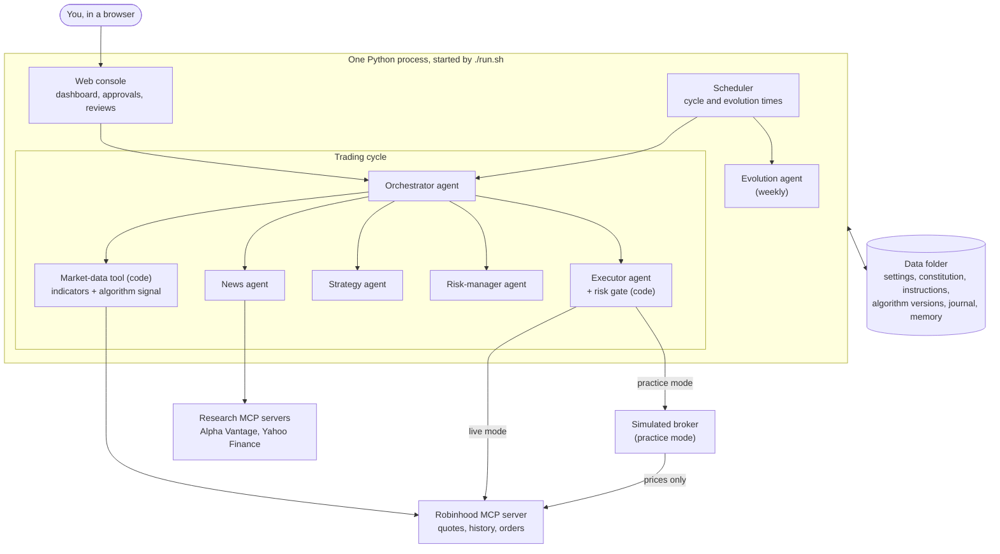
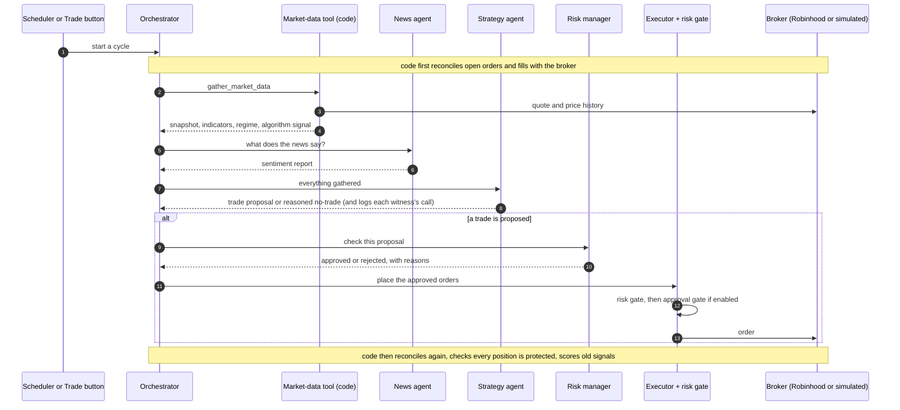

# Architecture

How EvoTrader fits together, kept short on purpose. Each section ends with
where to look in the code. For setup and safety, start with the
[README](../README.md).

## The parts



**Web console.** A FastAPI server with a single-page front end on port 8080.
It shows positions, the account chart, the algorithm's signal, every cycle's
reasoning, token usage, and the evolution output. It is also where you
approve trades, activate new instruction or algorithm versions, apply or
reject proposals, and edit your notes. Live updates reach the browser as a
stream of server-sent events.
*Code:* `src/evotrader/web/server.py`, `src/evotrader/web/static/`.

**Scheduler.** A loop inside the web server that wakes every ten seconds and
starts a trading cycle or an evolution run when the time matches
`schedule.cycle_cron` or `schedule.evolution_cron` in `settings.yaml` (five-field
cron expressions, US Eastern time). The **AUTO** switches in the console turn
each schedule on or off. It never starts a task while another is running. You
can always start one by hand with **Trade** or **Evolve**.
*Code:* `scheduler_loop` in `web/server.py`, `src/evotrader/cron.py`.

**The agents.** Built with Google's Agent Development Kit (ADK). Each agent's
instructions are Markdown files in your data folder, and each can use a
different model (the `model:` section of `settings.yaml`; models outside
Gemini are reached through LiteLLM).

| Agent | Job | Can it place orders? |
|---|---|---|
| orchestrator | Runs the cycle: gathers data, calls the other agents in order | Can only cancel orders |
| news_sentiment | Reads news and sentiment feeds, reports what matters for the ticker | No |
| strategy | Weighs the algorithm's signal, the news and the market snapshot; proposes a trade or a reasoned no-trade; writes the note for the next cycle | No — proposes only |
| risk_manager | Checks each proposal against the constitution with a code tool | No |
| executor | Turns an approved proposal into broker orders (named `execution` inside the cycle) | Yes, through the risk gate |
| evolution | Weekly: studies results and code, writes proposals and reviews | No |

The strategy and evolution agents can also run on Claude Code, billed to a
Claude subscription; the other agents always use the API
([docs/claude_code_evolution.md](claude_code_evolution.md)).
*Code:* `src/evotrader/agents/factory.py` builds every agent;
`agents/tools.py` holds their tools; `agents/instructions.py` loads the
instruction files.

**The algorithm.** Plain code, no AI. Each *strategy* in
`algorithms/strategies/` (momentum, mean reversion, gap, VWAP z-score and six
more) reads the market snapshot — prices; standard indicators such as RSI,
MACD and Bollinger bands (measures of momentum and of how stretched a price
is) and VWAP (the day's average traded price); and the detected market
*regime* (trending up, trending down, range-bound or high volatility) — and
returns a vote between −1 (sell) and +1 (buy). The *composite engine* combines the votes with weights
that depend on the regime. A strategy that has nothing to say abstains, and its
weight is shared among the ones that voted, so silence is never counted as a
neutral opinion. Which strategies exist is listed in `strategy_manifest.yaml`;
their parameters and weights live in numbered *algorithm versions* in your data
folder (`algorithms/<version>/config.yaml`), and `active.yaml` names the one in
use.
*Code:* `algorithms/composite.py`, `algorithms/loader.py`,
`algorithms/registry.py`, `indicators/`.

**The risk gate and the constitution.** `constitution.yaml` holds the hard
limits, and nothing the agents can call writes to it. They are enforced twice
in code: by `check_risk_limits`, the risk manager's tool (order size, buying
power, daily loss, trades per day, the pause after a losing streak, trading
hours), and by the *risk gate*, a callback that runs before every order tool
the executor calls (allowed tickers, order size, no short sale beyond the
shares held, no margin). The gate also makes every protective stop order
good-till-cancelled and, when `require_trade_approval` is on and the console
is running, waits for your click. Rules meant for new positions never block
closing or protecting an existing one.
*Code:* `callbacks/risk_gate.py`, `callbacks/exit_policy.py`,
`create_execution_agent` in `agents/factory.py`, `check_risk_limits` in
`agents/tools.py`, `models/config.py` (`Constitution`).

**Broker and data access through MCP.** MCP (Model Context Protocol) is a
standard way for agents to call outside tools. Providers are bound to *roles*
in `settings.yaml`: `trading` is Robinhood's official MCP server, reached over
HTTPS after you sign in on Robinhood's own page (OAuth; the token is cached in
`~/.evotrader/oauth/`); `research` is the Alpha Vantage MCP server with a
local Yahoo Finance server (the `stock-analysis` package) as a fallback.
*Code:* `src/evotrader/mcp/`, `create_mcp_toolsets` in `agents/factory.py`.

**Practice mode.** In `mode: sim` a proxy sits between the agents and the
Robinhood connection. Account, portfolio and order calls go to a simulated
broker that keeps its own account in SQLite and fills orders against live
quotes; read-only market data (quotes, price history, option chains) passes
through to Robinhood; every other broker tool is refused. That is why practice
mode still needs a Robinhood login.
*Code:* `src/evotrader/sim/sim_proxy.py`, `sim/sim_broker.py`.

**The data folder.** Everything that belongs to one user: `settings.yaml`,
`constitution.yaml`, `.env`, `instructions/`, `algorithms/`, `evolution/`,
`notes/`, the SQLite databases (trade journal, cycle history and agent
thoughts, signal record, token telemetry) and the agents' long-term memory (a
ChromaDB vector store holding your notes and past trade experiences). Practice
mode keeps its own databases and memory under `sim/`. The folder is `data/` in
the project unless `EVOTRADER_DATA_DIR` or `--data-dir` says otherwise.
*Code:* `src/evotrader/paths.py` (every path into the folder comes from
`data_dir()`), `config.py`, `db/`, `tools/memory.py`.

## One trading cycle, step by step



1. **Start.** The scheduler or the **Trade** button starts a fresh agent
   session. Code reconciles pending orders and fills with the broker, so the
   journal matches reality before anyone reasons about it.
2. **Market data.** The orchestrator calls `gather_market_data`, which is code,
   not an agent: it fetches the quote and price history, computes the
   indicators, detects the regime and runs the composite engine.
3. **News.** The news agent reads news and sentiment and reports anything that
   could move the ticker.
4. **Decision.** The strategy agent gets all of it, plus the note the previous
   cycle left, and returns either a trade proposal (entry, size, protective
   stop) or a reasoned decision not to trade. It records each witness's call
   with `log_signal_attribution`.
5. **Risk check.** If an order is proposed, the risk manager checks it against
   the constitution.
6. **Execution.** The executor places approved orders. Each order passes the
   risk gate, then the approval gate if it is on; in practice mode the
   simulated broker fills it.
7. **After the cycle.** Code reconciles again, checks that every open position
   has its protective orders resting at the broker, and scores older signal
   records whose one- or five-day horizon has passed.

The orchestrator is itself an AI agent, so the order above comes from its
instructions. Code watches the result: a cycle is marked *partial* if the
market-data or strategy step never ran, and a *pipeline stall* is recorded if
the strategy named an order but the risk or execution step never ran.
*Code:* `run_cycle_task` in `src/evotrader/main.py`,
`create_orchestrator_agent` in `agents/factory.py`.

## The self-evolve loop

```text
every cycle      ->  signal record: what each witness said, before they were combined
after the market ->  forward returns filled in (1 and 5 trading days later)
weekly           ->  evolution agent: reads cycles, scores and code; writes proposals
you              ->  review in the console: activate, apply or reject
self-evolve      ->  implement: failing test, fix, full tests, practice cycle
```

- **The record.** Every cycle stores the algorithm's call, the news call and
  the strategy agent's own call, even when nothing was traded: cycles without a
  trade are the control group. `AttributionScorer` later writes what the price
  did, so the system can measure which witness actually predicts, and whether
  stated confidence matches the hit rate. *Code:* `db/signal_attribution.py`,
  `evolution/attribution_scorer.py`.
- **The evolution run.** Weekly on `schedule.evolution_cron`, or on the
  **Evolve** button (you can add a question for it). The agent reads a digest
  of recent cycles, performance figures, the scored record and the source code,
  then writes:
  - new **algorithm versions** (new folders in `algorithms/`, not active);
  - new **instruction versions** for an agent (the risk manager's are
    protected, and there is a weekly limit);
  - **strategy proposals** in `evolution/proposals/` (a new strategy, a weight
    change, retiring a strategy);
  - **code reviews** in `evolution/reviews/` (findings by severity, with
    suggested diffs);
  - running **carry-forward notes** in `evolution/notes/carry_forward.md`.

  It can read everything and change nothing that trades: code changes are only
  proposals, and with `evolution.auto_promote: false` (the default) a new
  version stays inactive until you activate it.
  *Code:* `evolution/evolution_service.py` (API runtime),
  `evolution/claude_code_service.py` (Claude Code runtime),
  `evolution/tools.py`, `evolution/instruction_evolver.py`,
  `evolution/proposals.py`.
- **Your review.** In the console under **Memory & Notes**: *Agent
  Instructions* and *Algorithm Proposals* (activate or reject a version, with a
  diff against the current one) and *Proposals* (apply or reject a proposal or
  code review). The console owns the `Status` of each proposal and review.
- **Implementation.** A person, or Claude Code with the `self-evolve` skill
  (`skills/self-evolve/SKILL.md`), builds the approved change: read the note
  and the code it cites, write a failing test that reproduces the problem, fix
  it, run the whole test suite, check the algorithm still loads, and run a
  practice cycle before it touches real money. A before-and-after backtest is a
  smoke test for a broken engine, not a scorecard: the scored live record is
  what calibrates the system.

Two real outputs of this loop, anonymised, are in [examples/](examples/).

## Where to find things

| Area | Path |
|---|---|
| Entry point, start-up, cycle runner | `src/evotrader/main.py` |
| Configuration models (settings, constitution) | `src/evotrader/models/config.py`, `src/evotrader/config.py` |
| Data-folder location | `src/evotrader/paths.py` |
| Agents and their wiring | `src/evotrader/agents/factory.py` |
| Agent tools (market data, risk checks, journal, attribution) | `src/evotrader/agents/tools.py` |
| Claude Code runtime for agents | `src/evotrader/agents/cli/`, `agents/cli_agent.py` |
| Algorithm: composite engine, strategies, versions | `src/evotrader/algorithms/` |
| Indicators and regime detection | `src/evotrader/indicators/` |
| Risk gate and exit rules | `src/evotrader/callbacks/` |
| Broker and research connections, sign-in | `src/evotrader/mcp/` |
| Simulated broker | `src/evotrader/sim/` |
| Databases and migrations | `src/evotrader/db/` |
| Evolution | `src/evotrader/evolution/` |
| Web console | `src/evotrader/web/` |
| First-run setup questions | `src/evotrader/onboarding.py` |
| Backtests (algorithm only, no AI) | `src/evotrader/backtest/` |
| Scenario tests for agent instructions | `src/evotrader/scenarios/` |
| Starter data copied into a new data folder | `starter_data/` |
| Skills for coding agents | `skills/` (`self-evolve` is linked into `.claude/skills/`) |
| Tests | `tests/unit/`, `tests/js/` |
